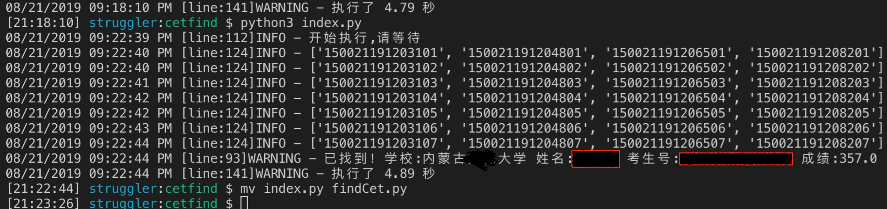

# 四六级准考证多线程找回

## 实际效果：



## 如何使用

```shell
pip3 install -r requirements
python3 findCet1.py [\d]{6} [12]{1} [\w]{2,3}
```
## 提示

代码仅供学习，切勿用作违法用途！如有问题可以加我微信

## 联系方式：
**我的公众号：**


-------（wx-struggler）-------

**个人微信：**
（strongdreams）期待我们有共同语言！
